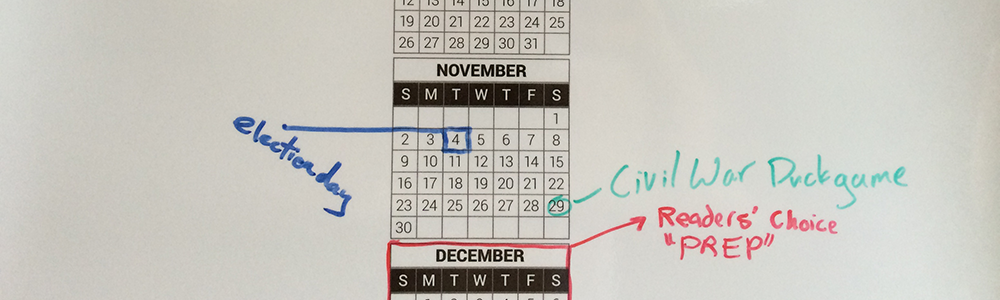

# Calla-illy

Print-optimzed months-in-year calendar to assist workplace productivity.

Intended to be laminated (with dry-erase laminate) and hung in workplace for folks to mark important dates and make notes in gutter space.

Alternatively, one could skip laminating and just draw on print directly (thus, saving $$$).

## Illustrator

The months in the main Illustrator file (`calla-illy.ai`) are setup up using the Area Type tool.

When altering dates with the type tool, <kbd>CMD</kbd> `+` <kbd>A</kbd> and start typing; use the <kbd>return</kbd> key to jump from box to box.

### Artboard Dimensions:

`24`" x `47.916`"

### Fonts:

The TrueType fonts used are included in the repo, though one could [download from Google directly](http://www.google.com/fonts/specimen/Roboto).

[Roboto](http://www.google.com/fonts/specimen/Roboto) by [Christian Robertson](https://plus.google.com/110879635926653430880/about)  
[Apache License, version 2.0](http://www.apache.org/licenses/LICENSE-2.0.html)

* Roboto Thin
* Roboto Light
* Roboto Medium
* Roboto Black

## Note(s)

* When updating this repo for a new year, **don’t forget to [create a release](https://help.github.com/articles/creating-releases) for the previous year**.

## Links

* [Adding Dates to a Calendar in Illustrator](http://www.deke.com/content/adding-dates-a-calendar-illustrator)

---

#### LEGAL

Copyright © 2014 [Micky Hulse](http://mky.io)

Licensed under the Apache License, Version 2.0 (the “License”); you may not use this work except in compliance with the License. You may obtain a copy of the License in the LICENSE file, or at:

[http://www.apache.org/licenses/LICENSE-2.0](http://www.apache.org/licenses/LICENSE-2.0)

Unless required by applicable law or agreed to in writing, software distributed under the License is distributed on an “AS IS” BASIS, WITHOUT WARRANTIES OR CONDITIONS OF ANY KIND, either express or implied. See the License for the specific language governing permissions and limitations under the License.

