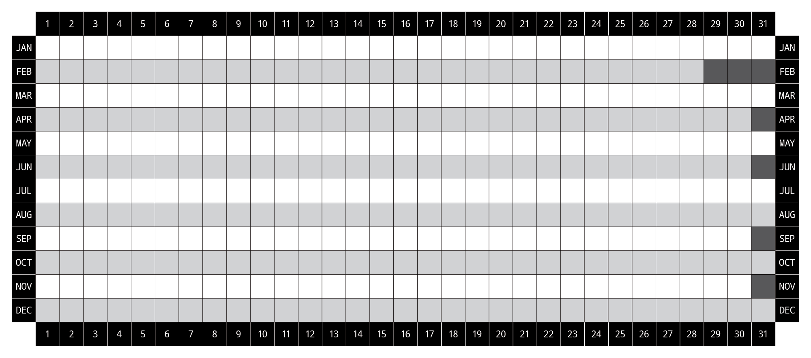
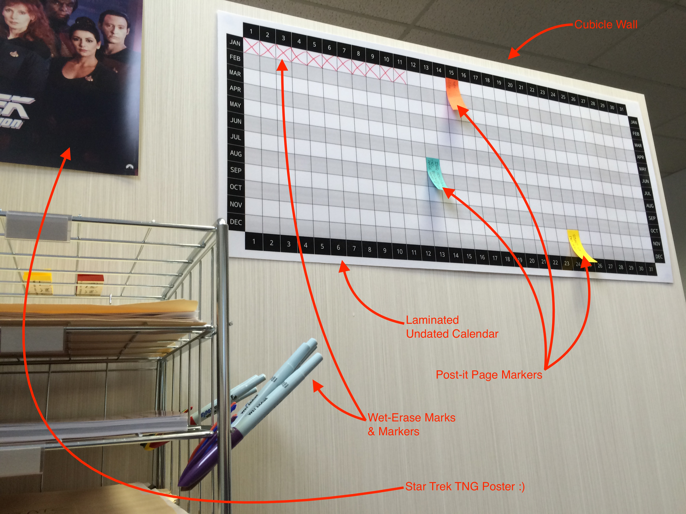

# Undated Calendar

* **Artboard Dimensions:** 34" x 15.0433"
* **Color Mode:** CMYK color
* **Color Profile:** U.S. Web Coated (SWOP) v2
* **Fonts:** [Droid Sans Mono (TrueType)](https://www.google.com/fonts/specimen/Droid+Sans+Mono)

I recommend printing at FedEx Office; send [`undated-calendar.pdf`](https://github.com/mhulse/undated-calendar/raw/master/undated-calendar.pdf) to <printandgo@fedex.com> and give “Retrieval Code” to a FedEx representative. From there, have them do a plotter print and ask for it to be trimmed and laminated. The completed calendar should run you about $15.

Use [1" x 3" Post-it Page Markers](http://amzn.com/B003IJW6IY) and/or [Expo Vis-A-Vis Wet-Erase Overhead Transparency Markers](http://amzn.com/B00006IFGW). Finally, use [Blu-Tack Reusable Adhesive](http://amzn.com/B001FGLX72) to affix the laminated calendar to your wall.

Original/alternative year calendar [can be found here](https://github.com/mhulse/undated-calendar/tree/calla-illy).

---

Copyright © 2016 [Michael Hulse](http://mky.io)

Licensed under the Apache License, Version 2.0 (the “License”); you may not use this work except in compliance with the License. You may obtain a copy of the License in the LICENSE file, or at:

[http://www.apache.org/licenses/LICENSE-2.0](http://www.apache.org/licenses/LICENSE-2.0)

Unless required by applicable law or agreed to in writing, software distributed under the License is distributed on an “AS IS” BASIS, WITHOUT WARRANTIES OR CONDITIONS OF ANY KIND, either express or implied. See the License for the specific language governing permissions and limitations under the License.

